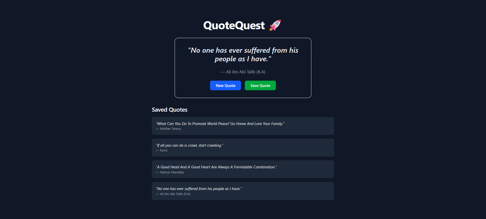

# 🪴 **QuoteQuest App**

*Quote Quest: A Journey to Your Highest Truth & Potential Through Self-discovery.*

---

### 🚀 **Project Demo**



---

### 🔗 **Live Preview**

[Click here to view the live site](https://web-development-mastery-jwpw-hmvdu45u9-tanish-kumars-projects.vercel.app/)

---

## 📌 **Features**

* ✅ Fetches a random quote from an API
* ✍️ Displays the quote and the author
* 🎨 Dark-themed UI using Tailwind CSS
* 🔄 New quote on button click
* 📲 Fully responsive design

---

## 🛠️ **Tech Stack**

* **React** – Frontend library for building dynamic UI
* **Tailwind CSS** – Utility-first CSS framework for styling
* **Vite** – Fast and efficient build tool

---

## 🧩 **Folder Structure**

```
quotequest/
├── public/
│   └── preview.png
├── src/
│   ├── components/
│   │   └── QuoteCard.jsx
│   ├── App.jsx
│   └── index.css
```

---

## 🚀 **Getting Started**

```bash
# Download the repository

Repo - https://github.com/TanishKumarDev/WebDevelopment_Mastery/tree/b9f7c6f5983038afb59af9604aacae7b54992d08/Projects/quotequest

```
## ⚙️ **Plain JavaScript Quote Fetch Logic**

```javascript
// Fetch a random quote from a public API
fetch("https://api.quotable.io/random")
  .then((res) => res.json())
  .then((data) => {
    console.log(data.content, data.author);
  });
  ```
---

## 🙌 **Acknowledgements**

Built with ❤️ by **Tanish** using React and Tailwind CSS.

> You can connect with me on [LinkedIn](https://linkedin.com/in/tanish29)
